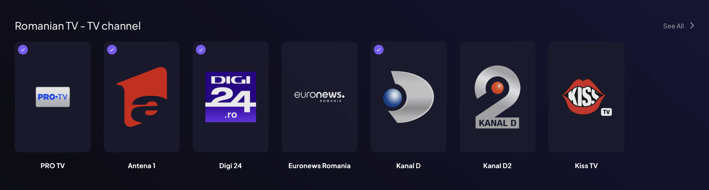

# Romanian TV - Stremio Addon

Un addon Stremio care oferă canale IPTV românești live.

## Funcționalități

- **Canale TV Românești Live** - Acces la toate canalele românești din iptv-org
- **Filtrare pe Genuri** - Răsfoiește canalele pe categorii (Știri, Sport, Divertisment, etc.)

### Vizualizare Pagină Principală


### Descoperă cu Filtre


## Instalare pe Stremio

Pentru a instala addon-ul pe aplicația Stremio sau pe web player:

1. **Vizitează pagina addon-ului**: https://romanian-tv-stremio.up.railway.app/
2. Click pe **"Instalează pe Stremio Web"** sau **"Instalează pe Aplicația Stremio"**
3. Confirmă instalarea în Stremio

Asta e tot! Acum poți răsfoi canalele TV românești în catalogul tău Stremio.

## Suport

Îți place acest addon? ♥️ Susține-mă!

[](https://ko-fi.com/dianadragoi#)

## Development Setup (dev only)

If you want to run the addon locally for development:

### Prerequisites

- Node.js 18.x or higher
- npm 8.x or higher

### 1. Clone or Download

```bash
git clone <your-repo-url>
cd romanian-tv-addon
```

### 2. Install Dependencies

```bash
npm install
```

### 3. Start the Server

```bash
npm start
```

For development with auto-reload:

```bash
npm run dev
```

### 4. Install in Stremio (Local)

Once the server is running locally:

1. Visit `http://localhost:3000/` in your browser
2. Click "Install on Stremio Web" or "Install on Stremio App"
3. Or manually copy the manifest URL: `http://localhost:3000/manifest.json`

## Project Structure

```
romanian-tv-addon/
├── addon.js          # Main application file (~370 lines)
├── package.json      # Dependencies and metadata
├── .gitignore        # Git exclusions
└── README.md         # This file
```

## How It Works

### Data Sources

The addon fetches data from the iptv-org API:
- **Channels**: https://iptv-org.github.io/api/channels.json
- **Streams**: https://iptv-org.github.io/api/streams.json
- **Logos**: https://iptv-org.github.io/api/logos.json

### Endpoints

| Endpoint | Description |
|----------|-------------|
| `GET /` | Landing page with installation instructions |
| `GET /manifest.json` | Stremio manifest (addon metadata) |
| `GET /catalog/:type/:id/:extra?.json` | Channel catalog with search/genre filters |
| `GET /meta/:type/:id.json` | Channel metadata (name, description, poster) |
| `GET /stream/:type/:id.json` | Stream URL for playback |

### Caching Strategy

- **Channels/Streams/Guides**: 1 hour TTL (Time To Live)
- **Logos**: 24 hour TTL

## Development

### Running Locally

```bash
npm run dev
```

This uses `nodemon` to automatically restart the server when you make changes.

### Testing the Addon

After starting the server, you can test the endpoints:

1. **Manifest**: http://localhost:3000/manifest.json
2. **Catalog**: http://localhost:3000/catalog/tv/rotv-all.json
3. **Search**: http://localhost:3000/catalog/tv/rotv-all/search=pro.json
4. **Genre Filter**: http://localhost:3000/catalog/tv/rotv-all/genre=news.json


### Health Check

For monitoring, you can add a health check endpoint:

```javascript
app.get('/health', (req, res) => {
    res.json({ status: 'ok' });
});
```

## Customization

### Change Country

To adapt this addon for a different country, modify the `COUNTRY` constant in `addon.js`:

```javascript
const COUNTRY = 'RO'; // Change to 'FR', 'DE', 'IT', etc.
```

Also update:
- Manifest `id`, `name`, `description`
- Channel ID prefix (`rotv-` to something else)
- Landing page content

### Add More Catalogs

You can add genre-specific catalogs in the manifest:

```javascript
catalogs: [
    {
        type: 'tv',
        id: 'rotv-news',
        name: 'Romanian News Channels',
        extra: [{ name: 'search' }]
    },
    // ... more catalogs
]
```

Then filter in the catalog endpoint based on `req.params.id`.

## Troubleshooting

### No Channels Appearing

- Check if Romanian channels exist in iptv-org API
- Check console for fetch errors
- Verify streams are available for the channels

### Streams Not Playing

- Not all streams in iptv-org are guaranteed to work
- Some streams may be geo-restricted
- Try a different channel

### Slow Loading

- First load fetches all data (can take a few seconds)
- Subsequent loads use cache (much faster)
- Consider reducing TTL if data updates frequently

## Credits

- **iptv-org**: https://github.com/iptv-org/iptv - For providing the IPTV channels database
- **Stremio**: https://www.stremio.com/ - For the amazing media center platform ♥️

## License

MIT

## Contributing

Feel free to open issues or submit pull requests for improvements!

## Roadmap

Potential future enhancements:
- Stream health checking
- Fallback streams if primary fails
- Romanian language metadata
- Favorites system
- Analytics/usage tracking
- Rate limiting
